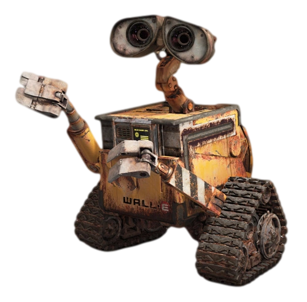
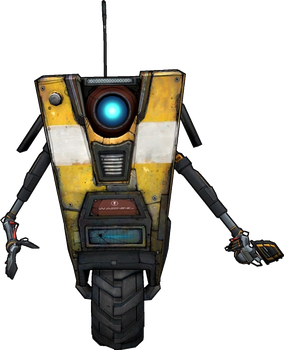
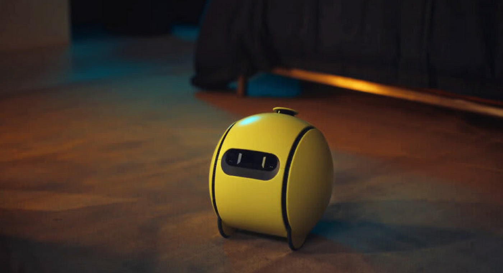
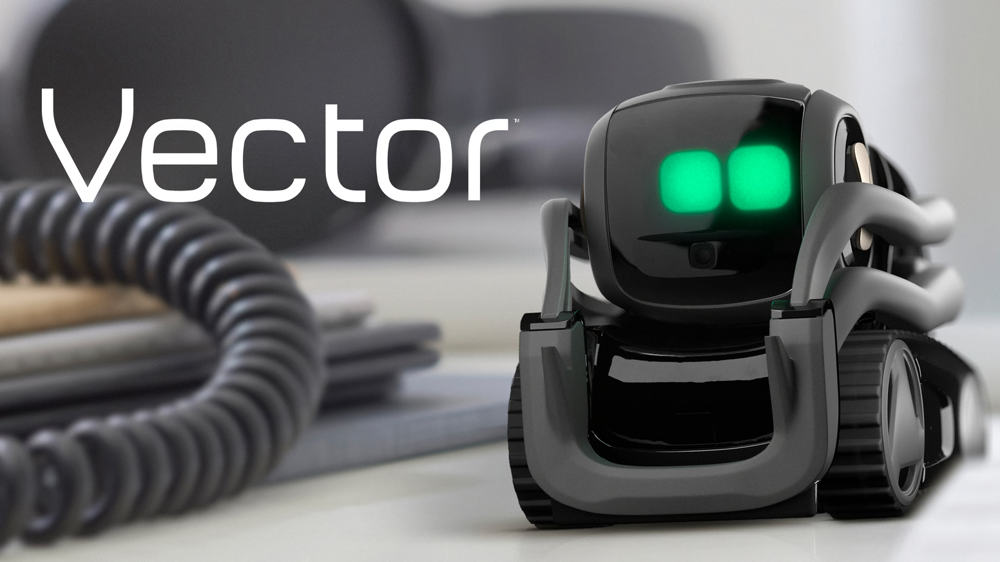
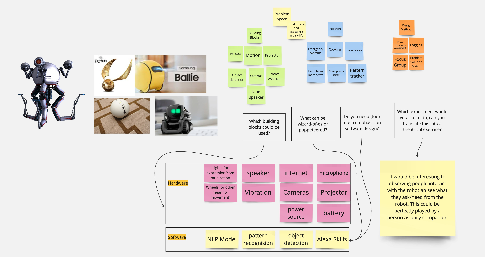

# Session 1 - Design Tools

## 🧑‍🧑‍🧒‍🧒 Group Work

During our first group meeting, we introduced ourselves so that everyone could understand each other's backgrounds and present study field. After the introductions, all the team members started suggesting ideas on how we should approach this task knowing the extra input from Edwin: "This time think about some robots that would be useful to _you_". My first proposal in this case was that we look into the robots that we all know and love from different scenarios like animated shows, movies, games or real life.

After examining some popular robot characters such as WALL-E, R2-D2, Baymax, Claptrap or the Personality Cores from the Portal game series (Portal ones being my favourite, links at the bottom if you wish to check them out) we tried to understand why these robots are so liked by the people. The conclusion we have arrived to is that despite some of them no being able to talk like R2-D2 and WALL-E, they all have well-developed "personalities" and show artificial emotions, which is a key reason for their appeal.

Based on this conclusion we tried to find some real-life robots that show similar traits. We found some, either in development like Samsung's Ballie (I'm wondering where that name came from), or already available for purchase such as Vector.

Drawing inspiration from these robot characters, we then define the traits and capabilities we wished our robot would inherit and aimed to create a robot that could not only perform tasks efficiently but also possess an engaging personality that would allow the robot to emotionally connect with the user

While doing so we put together the following mind map:

## ❓Reflective Questions

**1. In Social Robots from a human perspective22) an overview of the state of the art in Social Robotics is given, organized in topics of human perception and expectation (Part I), Interaction (Part II) and application domains (Part III). Read (a.o.) chapter 8. Which pointers does this chapter give in/to a design research approach?**

This was the most boring class ever fuck my life into pieces

2. Second item

