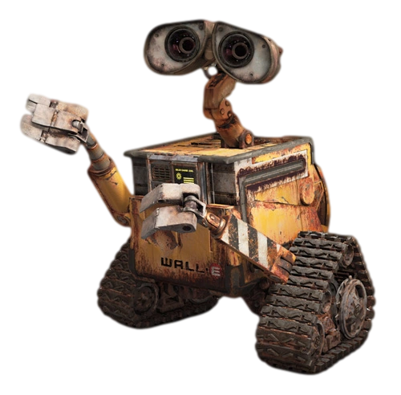
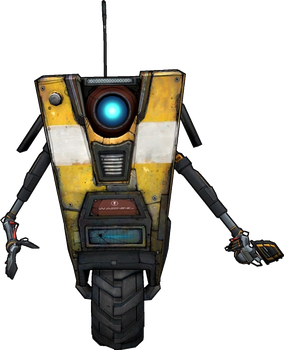

# Session 2 - Story Building

## 🧑‍🧑‍🧒‍🧒 Group Work

For this assignment our group came up with a tool that uses cards for building stories, inspired by the "Cards
Againts Humanity" card game. The tool is fairly simple as it consists of two types of cards. First type is a scenery
or scenario card and the second type is the object card. The recommended "rules" of this tool are as following:
the user picks a scenario card and multiple object cards and with these they could come up with different stories.
Furthermore, after having one short story that the user is happy with they could add to it by adding different
scenarios.

As none of us have a drawing hidden talent we used Dall-E to generate our card images using prompts like:

"Generate some doodle drawings of objects on cards like Cards Against Humanity but without text"
"Generate some doodle drawings of different scenarios on cards like Cards Against Humanity but without text"

### Example of cards

