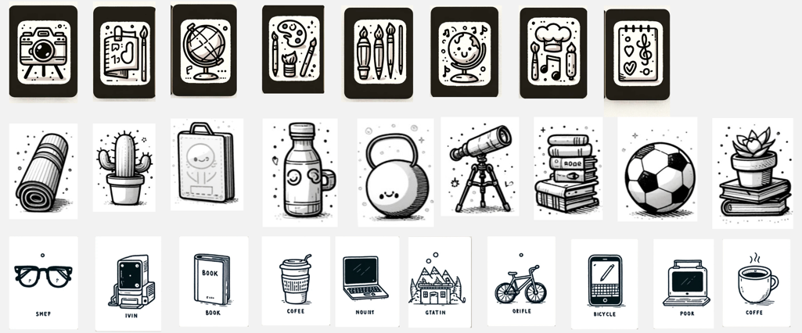
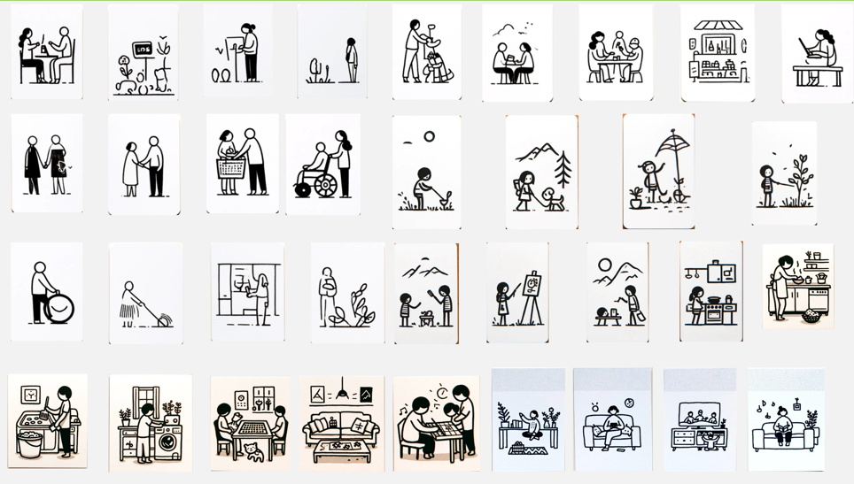
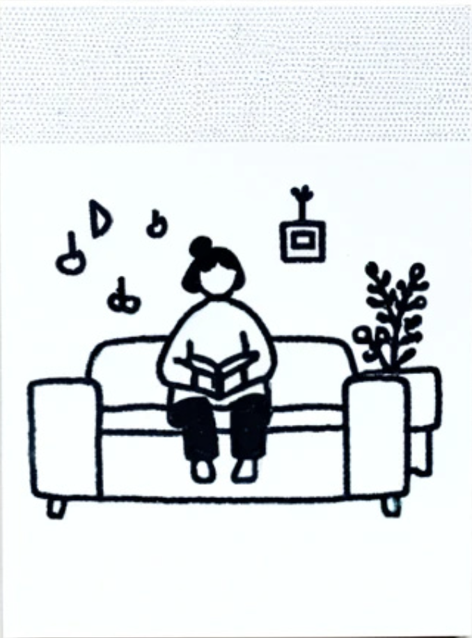
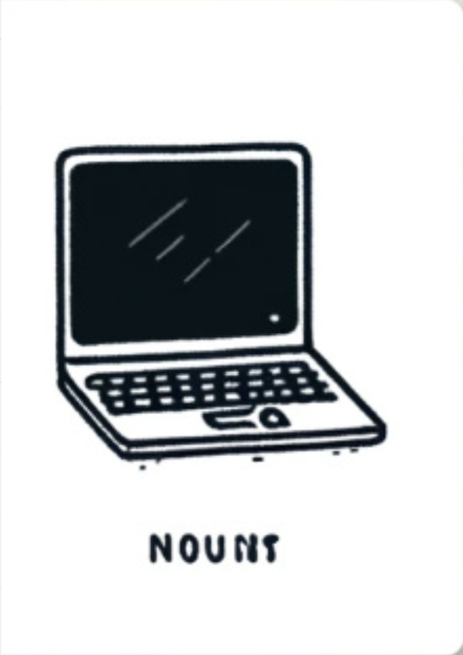
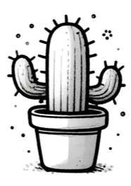
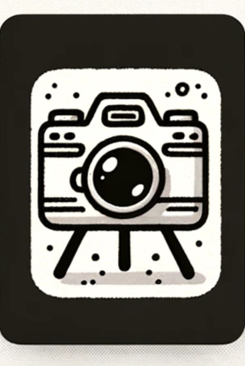
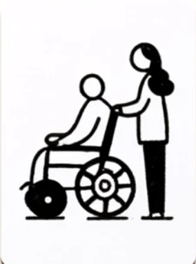
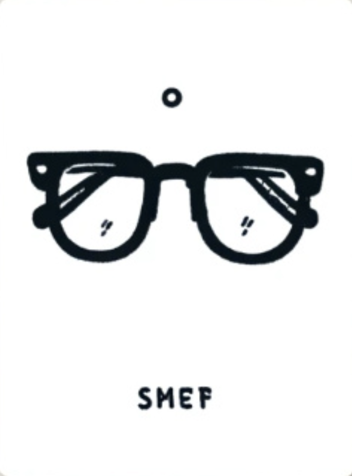
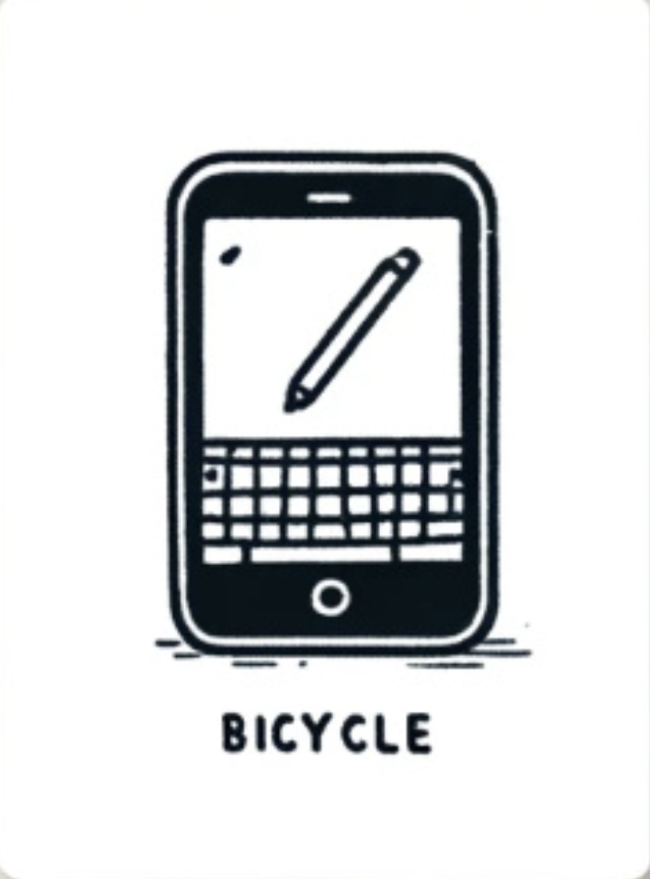

# Session 2 - Story Building

## 🧑‍🧑‍🧒‍🧒 Group Work

For this assignment our group came up with a tool that uses cards for building stories, inspired by the "Cards
Againts Humanity" card game. The tool is fairly simple as it consists of two types of cards. First type is a scenery
or scenario card and the second type is the object card. The recommended "rules" of this tool are as following:
the user picks a scenario card and multiple object cards and with these they could come up with different stories.
Furthermore, after having one short story that the user is happy with they could add to it by adding different
scenarios.

As none of us have a drawing hidden talent we used Dall-E to generate our card images using prompts like:

"Generate some doodle drawings of objects on cards like Cards Against Humanity but without text"

"Generate some doodle drawings of different scenarios on cards like Cards Against Humanity but without text"

This is why in the examples below the phone is bicycle and the bicycle is "orifle".

### Example of Object Cards

### Example of Scenario Cards

### Evaluation of our storytelling method

#### Strengths

* Simple and Easy to Use: The two card system makes the tool accessible to a wide range of users and applications 
  and tries to eliminate a blockage in the creative process by providing prompts.
* Usage Versatiliy: It can be used in a high variety of situations and scenarios.
* Card Expansion: The card set is easely expandable by just doodleing additional scenarios or objects.
* Adaptable for Different Use Cases: The tool can be sued by individuals or groups and the difficulty of scenarios 
  and objects can be adjusted depending on what's needed.

#### Weaknesses:

* Limited Complexity: The two-card format might restric the depth and complexity of the stories that need to be created.
* Reliance on Users Creativity: The quality of the stories will depend on the user's imagination. (This might be a 
  general thing)
* Too Random: Some combinations of scenario nad object cards might be too random and lead to stories that are not 
  cohesive.

#### Things that can be improved:

* Different card types: A lot of different card types can be introduced to make the tool more "powerful" one such 
  example being emotion cards
* Diversity in regard to the type of card: most cards are realistic ones in the example above but more could be 
  added like sci-fi or historical ones.
* This could be also easily digitized

### Scenarios Created With the Tool

#### Dark Scenario

Picked Cards:

  
  
  
  

The AI assistant robot checks with the camera periodically on the user that is on the living room couch to keep it addicted to the laptop and guiding the humans habits in such way that the laptop addiction influences their habits so much that they neglect other parts of their life such as the cactus that dries off and dies.

#### Good Scenario

Picked Cards:

  
  
  
  

In this situation there is a caretaker for an elderly person. The assistant robot reminds of the lady that by projecting an image of a pair of glasses on the wall next to her and plays a sound reminding her that the at this time usually the elderly person reads it's prayers and needs their glasses. When the caretaker gets the glasses to the elderly prayers the robots microphone picks up a notification sound and suggests to both of the humans to st the phone on mute for the prayer period.
